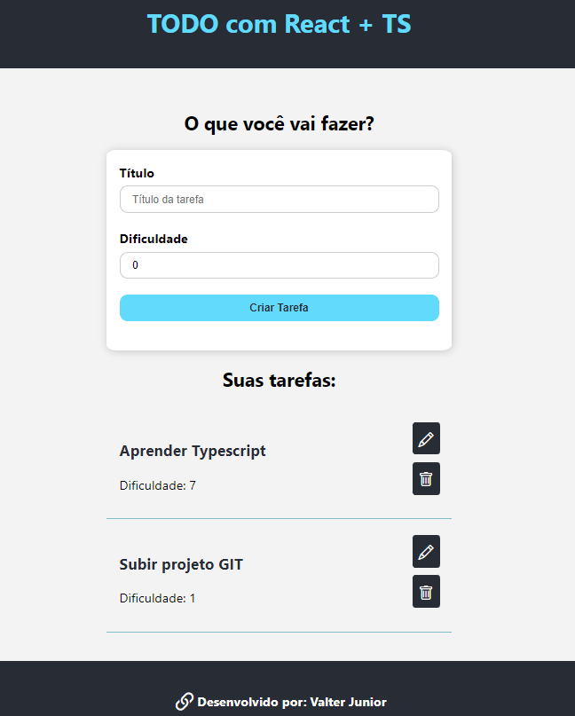
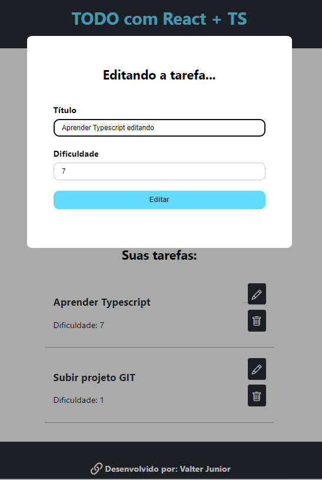

<h1 align="center">TODO com React + Typescript</h1>

 🚀 Estudo de Typescript

<h1 align="center"></h1>

•
 <a href="#objetivo">Objetivo</a> •
 <a href="#tecnologias">Tecnologias</a> • 
 <a href="#autor">Autor</a> •

<h1 align="center">
    
    
    
</h1>

## **Objetivo**

 🔍 Treinando como o React se comporta com o TS 

## **Tecnologias**

<ul>⚙️ Frontend    
    <li>🛠 React
    <li>🛠 Bootstrap
    <li>🛠 Typescript
</ul>

## **Autor**

 Desenvolvido por <a href="https://github.com/valtercfjunior">Valter Junior</a> 

